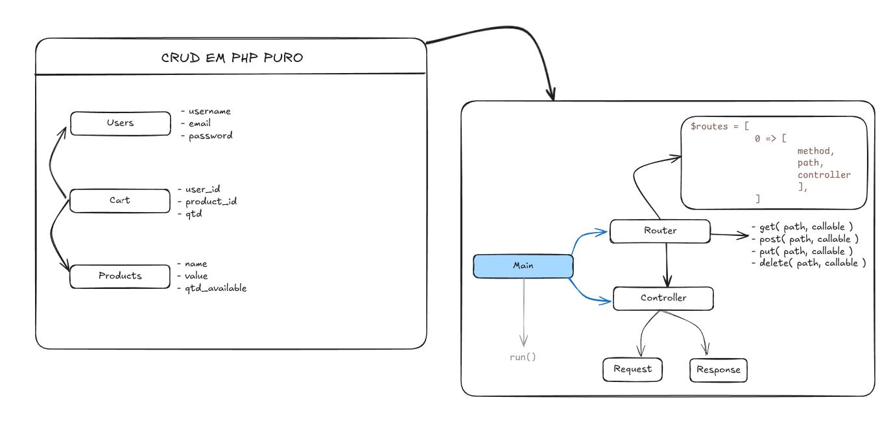
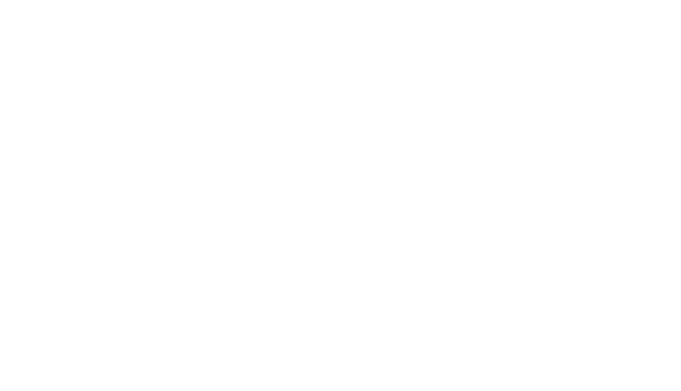

# Crud Em PHP Puro + Docker

Este projeto é um CRUD simples em PHP e surgiu do meu interesse em aplicar, de forma prática, os conceitos básicos de PHP que venho aprendendo. Optei por desenvolver algo simples e funcional, inspirado em parte na abordagem do Express para estruturar rotas e controladores.

-----

## Primeiros Passos

Para configurar e executar o projeto localmente, siga as instruções abaixo:

### Pré-requisitos

Certifique-se de ter o [Docker](https://docs.docker.com/get-docker/) e o [Docker Compose](https://docs.docker.com/compose/install/) instalados em sua máquina.

### Clonando o Repositório

Você pode clonar este repositório usando SSH ou HTTPS:

**Via SSH:**

```bash
git clone git@github.com:PabloSantos-CG/php-vanilla-crud.git
```

**Via HTTPS:**

```bash
git clone https://github.com/PabloSantos-CG/php-vanilla-crud.git
```

Após clonar, navegue até o diretório do projeto:

```bash
cd php-vanilla-crud
```

### Executando o Projeto com Docker Compose

Este projeto utiliza Docker para facilitar o setup do ambiente de desenvolvimento. Para iniciar os serviços (servidor web e banco de dados), execute o seguinte comando na raiz do projeto:

```bash
docker compose up -d
```

Este comando irá construir as imagens (se necessário), criar e iniciar os contêineres em segundo plano.

### Acessando a Aplicação

Após a inicialização dos contêineres, a aplicação estará disponível em:

[http://localhost:8080](https://www.google.com/search?q=http://localhost:8080)

---
## Esboço da Estrutura do Projeto


## Diagrama do Banco de Dados

